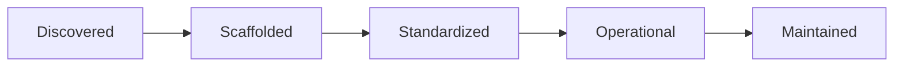

# README Codex Status

Add a `Codex Status` section to the repo `README.md`.

Recommended contents:

1. A compact status summary
   - current `codexification_stage`
   - current `operational_readiness`
   - `next_stage_target`
   - `template_version`

2. A visual stage path
   - use Mermaid or compact ASCII
   - highlight the current stage
   - make the next stage obvious

3. A checklist or scorecard excerpt
   - show the most important `assessment_checks`
   - keep it short enough to scan quickly

4. Remaining work
   - copy the current promotion gate from `codex-assessment.md`
   - keep it phrased as concrete next actions

5. Toolkit available now
   - shared foundation skills
   - repo-local skills if present
   - native verification commands

Recommended Mermaid shape:

Practical rule:

- `README.md` should be the thin dashboard
- `codex-template.json` should be the machine-readable summary
- `codex-assessment.md` should be the detailed evidence log
